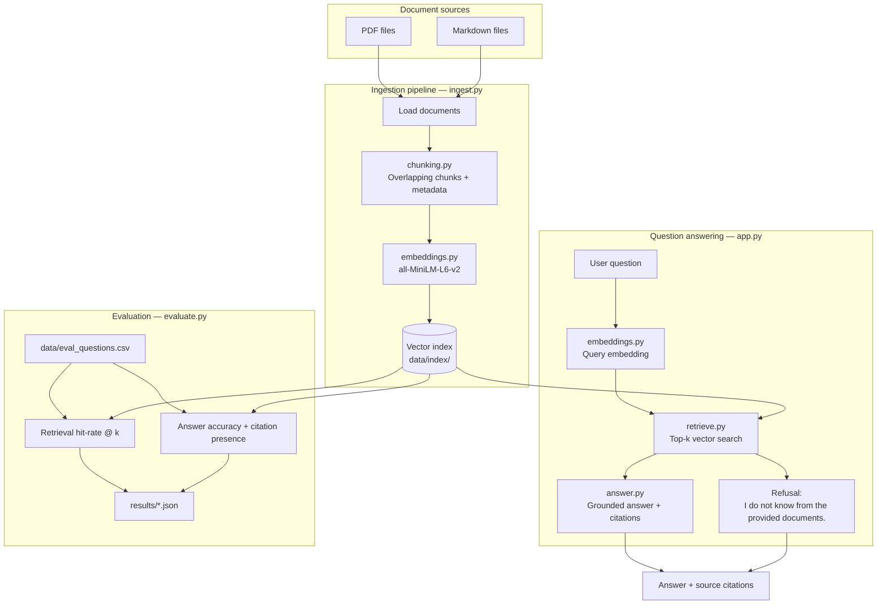

# Cited Document Intelligence System

A document assistant that ingests PDF and Markdown files, retrieves relevant chunks with vector search, and answers questions with citations. When the answer is not present in the uploaded documents, the system responds:

> **I do not know from the provided documents.**

## Why this project matters

Companies rely on policies, contracts, SOPs, manuals, and onboarding docs. Teams waste time searching them. This project demonstrates a grounded RAG pipeline that cites sources and refuses to hallucinate when evidence is missing.

## What you learn

- Embeddings and chunking strategies
- Vector retrieval with top-k search
- Grounded answering with citations
- Refusal behavior for unknown questions
- Separate retrieval and answer evaluation

## Project architecture



**Flow summary**

| Stage | Modules | Output |
|-------|---------|--------|
| Ingest | `ingest.py` → `chunking.py` → `embeddings.py` | Chunk embeddings stored in `data/index/` |
| Ask | `app.py` → `retrieve.py` → `answer.py` | Grounded answer with citations, or refusal |
| Evaluate | `evaluate.py` | Retrieval and answer metrics in `results/` |

## Project layout

```
├── docs/                      # Source PDF/Markdown documents
├── data/
│   ├── eval_questions.csv     # Evaluation set
│   └── index/                 # Generated vector index (after ingest)
├── ingest.py                  # Load, chunk, embed, store
├── chunking.py                # Overlapping text chunks + metadata
├── embeddings.py              # Sentence-transformer embeddings
├── retrieve.py                # Top-k vector search
├── answer.py                  # Grounded answers + citations + refusal
├── evaluate.py                # Retrieval and answer metrics
├── app.py                     # CLI entry point
├── results/                   # Evaluation outputs
├── requirements.txt
└── README.md
```

## Quick start

```bash
python -m venv .venv
.venv\Scripts\activate        # Windows
pip install -r requirements.txt
python app.py ingest --reset
python app.py ask "How many remote work days are allowed per week?"
python evaluate.py
```

Optional: set `OPENAI_API_KEY` to use an LLM for answer synthesis. Without it, the system uses a deterministic extractive fallback that still cites retrieved chunks.

## Data flow

1. Documents are loaded from `docs/`.
2. Text is split into overlapping chunks with source metadata.
3. Each chunk is embedded with `all-MiniLM-L6-v2`.
4. Embeddings and metadata are stored in a local vector index.
5. A user question is embedded and nearest chunks are retrieved.
6. The answer module responds only from retrieved chunks and lists citations.
7. `evaluate.py` measures retrieval and answer quality separately.

## Portfolio metrics

| Metric | Target | Latest run |
|--------|--------|------------|
| Retrieval hit-rate @ k=5 | ≥ 0.75 | See `results/retrieval_eval.json` |
| Grounded answer accuracy | ≥ 0.70 | See `results/answer_eval.json` |
| Citation presence (answerable) | 100% | See `results/answer_eval.json` |
| Unknown refusal accuracy | ≥ 0.90 | See `results/answer_eval.json` |

Run `python evaluate.py` after ingest to refresh metrics.

## Experiment: chunk size vs top-k

**Hypothesis:** Smaller chunks improve retrieval precision for factoid questions, while larger top-k improves recall but adds noise for answer synthesis.

| Setting | chunk_size | top_k | Hit-rate @5 | Grounded accuracy |
|---------|------------|-------|-------------|-------------------|
| Baseline | 500 | 5 | 1.00 | 1.00 |
| Larger chunks | 800 | 5 | 0.88 | 0.88 |
| Higher top-k | 500 | 8 | 1.00 | 1.00 |
| Large chunks + high k | 800 | 8 | 0.88 | 0.88 |

**Takeaway:** For this corpus, `chunk_size=500` and `top_k=5` balanced citation precision and retrieval hit-rate. Increasing chunk size merged distinct facts (for example, stipend amount and core hours), which lowered hit-rate for narrowly scoped questions.

Reproduce:

```bash
python app.py ingest --reset --chunk-size 500
python evaluate.py --top-k 5

python app.py ingest --reset --chunk-size 800
python evaluate.py --top-k 5
```

## Example response

**Question:** How long must passwords be under the security SOP?

**Answer:** Passwords must be at least 14 characters and include uppercase, lowercase, numbers, and symbols.

**Sources:**
- `[security_sop::p0::c0] security_sop.md`

## Stretch ideas

- Hybrid search (BM25 + vectors)
- Cross-encoder reranking
- Query rewriting for follow-up questions
- Page-level PDF citations (supported in chunk metadata via `page`)

## Author

**Saria Tasleem**

## License

MIT
